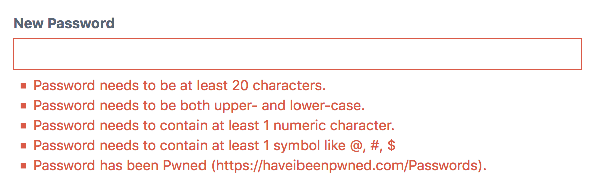
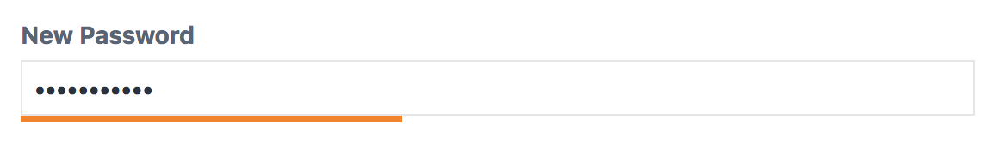
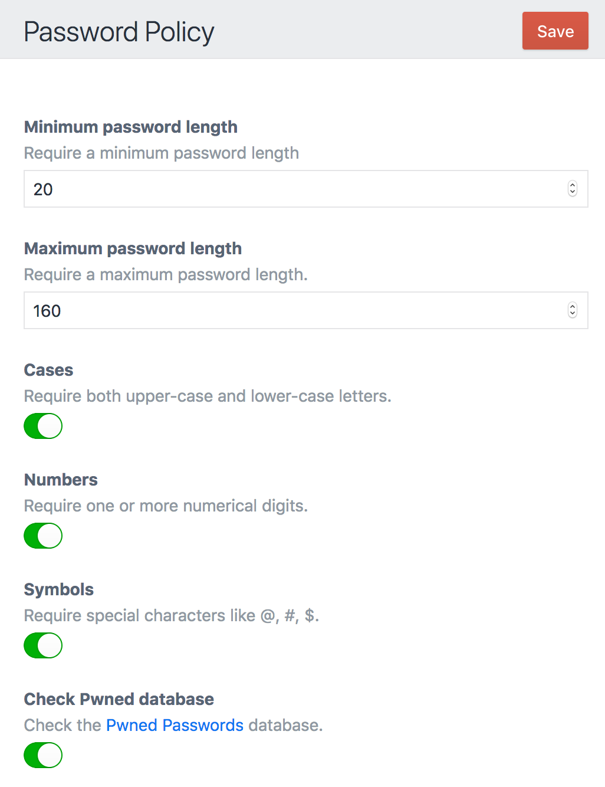

# Password Policy plugin for Craft CMS 3

Enforce a password policy on your users. This plugin can also check the [Have I been Pwned database](https://haveibeenpwned.com/Passwords) to make sure users use a password that is secure.

Policy Errors:


Password Strength Indicator


## Requirements

This plugin requires Craft CMS 3.0.0.

## Installation

You can install this plugin through the plugin store.

## Configuration

You can configure this plugin by adding a `config/password-policy.php` file:

```php
<?php

return [
    // Minimum password length
    "minLength" => 16,
    
    // Maximum password length
    "maxLength" => 160,
    
    // Force users to use different cases
    "cases" => false,
    
    // Require at least 1 number
    "numbers" => false,
    
    // Require at least one symbol
    "symbols" => false,
    
    // Check the Have I been Pwned database
    "checkPwned" => true,
    
    // Show a password strength indicator
    "showStrengthIndicator" => true,
];
``` 

Or through the plugin settings



Brought to you by [Percipio Global Ltd.](https://percipio.london)
